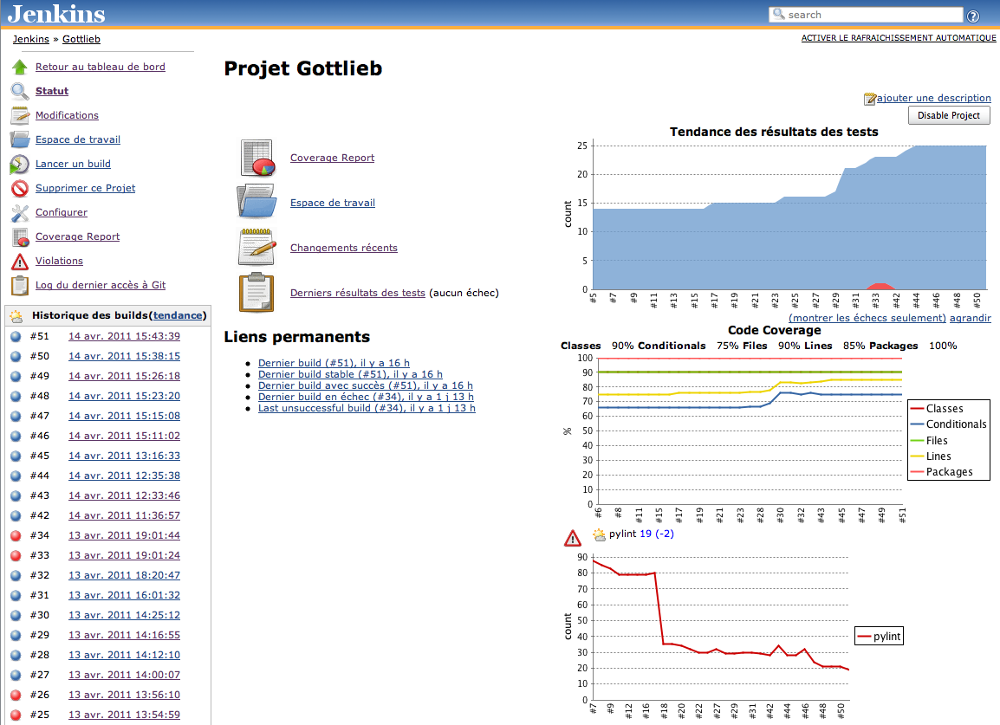

# Intégration continue d'un projet Django

.fx: home

---

# Qui suis-je ?

.fx: bigbullet

* Nicolas Perriault
* Développeur PYTHON & DJANGO
* [http://akei.com/](http://akei.com/)
* [https://twitter.com/n1k0](https://twitter.com/n1k0)

---

# Intégration quoi ?

.fx: centerquote

> L'intégration continue est un ensemble de pratiques utilisées en génie logiciel. Elles consistent à <strong>vérifier automatiquement à chaque modification de code source que le résultat des modifications ne produit pas de régression</strong> de l'application en cours de développement.

— <a href="http://wikipedia.org/">Wikipedia</a>

---

# En français ?

.fx: centerquote

> T'as le droit de tout péter, mais t'es obligé d'**être au courant**.

— <a href="https://twitter.com/n1k0">@n1k0</a>

---

# … ou comme dirait Jean-Claude

.fx: centerquote

> Il y a des gens qui n'ont pas réussi parce qu'ils ne sont pas *aware*, **ils ne sont pas au courant**. Ils ne sont pas à l'attention de savoir qu'ils existent. Les pauvres, ils savent pas. Il faut réveiller les gens.

— <a href="http://www.echolaliste.com/x28.htm">Jean-Claude Van Damme</a>

---

# Le but de l'intégration continue

.fx: bigbullet

* Avoir **confiance** en son propre code et celui de son équipe
* **Responsabiliser** les intervenants sur la qualité
* Pouvoir déployer plus **sereinement**
* Faire l'**apéro** plus tôt
* Soulager les perfectionnistes pressés sensibles au **stress**

---

# Comment ?

.fx: bigbullet

### Régulièrement et automatiquement :

* Contrôler l'**intégrité** unitaire et fonctionnelle
* S'assurer de l'absence de **régressions**
* Mesurer la **couverture** du code
* Surveiller le respect des **conventions** de codage
* Signaler les **erreurs** de codage
* Générer des **rapports** synthétiques utiles

---

# Jenkins

.fx: fullimage

---

# Jenkins

.fx: fullimage

---

# Jenkins

.fx: bigbullet

* Anciennement <i>Hudson</i>
* Serveur d'intégration continue
* Écrit en Java <small>(mais il fonctionne bien quand même)</small>
* Open Source  (sous licence MIT)
* Extensibilité, nombreux plugins
* Intégration avec les différents (D)VCS: Git, Mercurial, SVN, CVS <small>(ne riez pas)</small>
* [http://www.jenkins-ci.org/](http://www.jenkins-ci.org/)
