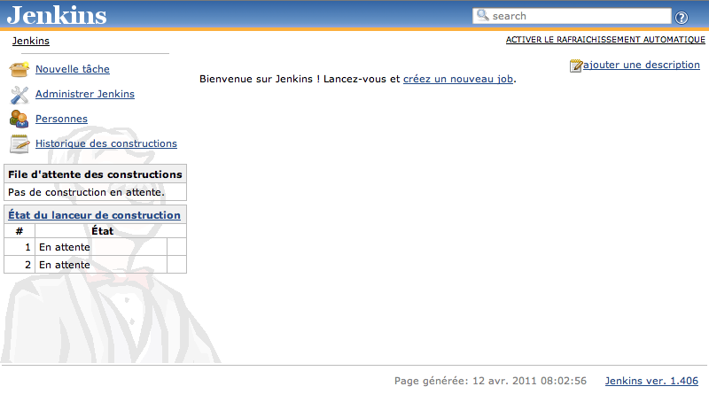
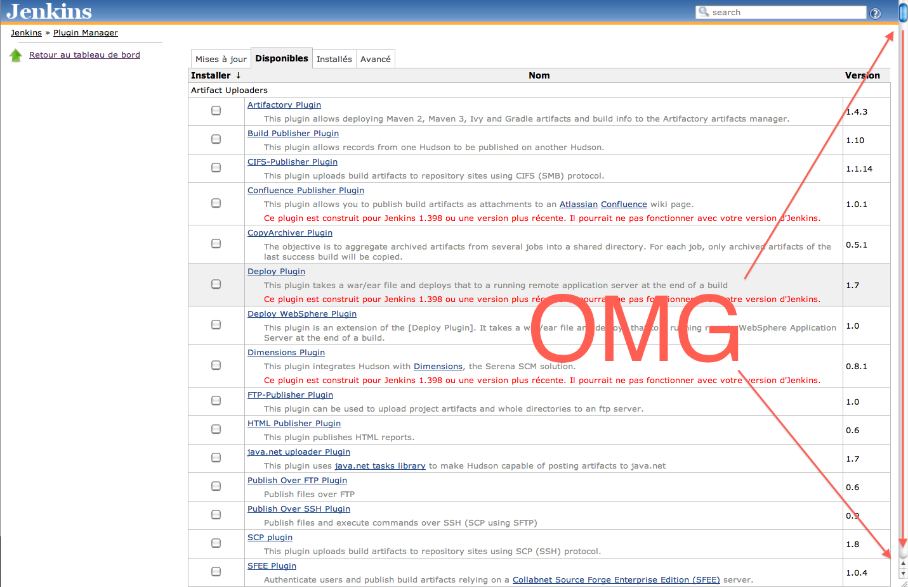

# Installation de <em>Jenkins</em>

.fx: title

---

## Installation de <em>Jenkins</em>

.fx: larger

### Ubuntu

    $ wget -q -O - http://pkg.jenkins-ci.org/debian/jenkins-ci.org.key \
        | sudo apt-key add -
    $ sudo apt-get install jenkins
    $ sudo /etc/init.d/jenkins start

### OSX (using `homebrew`)

    $ brew install jenkins
    $ java -jar /usr/local/Cellar/jenkins/1.396/lib/jenkins.war

### Windows

Allo ? Allo ? Je passe sous un tu

---

## localhost:8080

.fx: fullimage

---

# Plugins

.fx: title

---

# Plugins

.fx: fullimage

---

# Plugins INDISPENSABLES

.fx: bigbullet

* `Git`, `Mercurial`, `Bazaar`: Intégration de DVCS
* `Cobertura`: Intégration de métriques sur la qualité
* `Jabber`: Notification par messagerie instantannée
* `Doxygen`: Génération automatique de documentation
* `Twitter`: Notification twitter
* `Chuck Norriz`: ???